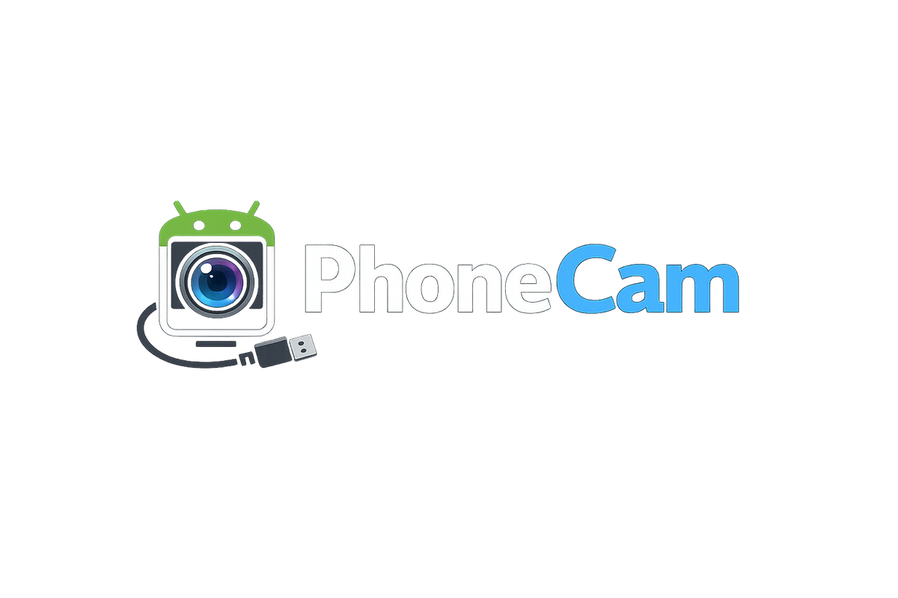

# PhoneCam



Turn an Android phone into a fast, high-quality **USB webcam** on Windows — recognized as a real camera device by every app (Zoom, Teams, Chrome, Windows Camera, OBS), not just an OBS plugin.

USB only. No root. Free, open-source, no watermark.

## Why

Every phone-as-webcam app (DroidCam, Iriun, Camo, iVCam) uses the same underlying trick: a companion PC driver that registers a virtual camera, fed by a stream from a phone-side app over USB. There's no shortcut around this on a non-rooted phone — Android only lets the phone *itself* enumerate as a real USB camera (`DeviceAsWebcam`) on Android 14+ with OEM support, which most phones (including the reference device for this project, a Redmi Note 8 on Android 11) don't have.

So PhoneCam plays that same architecture straight, and competes on what the paid incumbents under-serve or paywall:

- **All camera controls free** — exposure, focus (incl. tap-to-focus), zoom, torch, white balance, lens switch — driven live from the PC.
- **Synced audio** over the same USB cable (native Android UVC webcam mode is video-only).
- **A friendlier USB path** — Android Open Accessory (AOA) instead of forcing users through Developer Options → USB debugging.
- **Genuinely low latency** — hardware H.264, zero-copy capture, low-latency decode; targeting sub-150ms glass-to-glass.
- **No watermark, no paywall, no subscription.**

## Architecture

```
Android app                     USB                  Windows host              Virtual camera
Camera2 → MediaCodec   ──►  ADB-forward   ──►   Media Foundation    ──►   MFCreateVirtualCamera
(H.264, zero-copy)          or AOA             H.264 decode              seen by ALL apps
     ▲                                                 │
     └──────────────── control channel (bidirectional) ┘
```

The phone captures and hardware-encodes video, streams it over USB, and a Windows host process decodes it and feeds a registered [`MFCreateVirtualCamera`](https://learn.microsoft.com/en-us/windows/win32/api/mfvirtualcamera/) media source — which Windows' Frame Server serves to both Media Foundation apps (Chrome, Windows Camera, new Teams) and DirectShow apps (Zoom, classic OBS) at once. A bidirectional control channel carries camera commands (PC → phone) and capabilities/telemetry (phone → PC).

Two USB transports exist side by side, not one replacing the other:

- **ADB** (the default, fully proven path) — needs Developer Options → USB debugging on, but works reliably today with zero extra setup.
- **AOA** (Android Open Accessory) — the phone streams with USB debugging *off*, just a one-time "allow accessory" tap. Proven working end-to-end on the reference device, but currently needs a one-time manual driver step ([Zadig](https://zadig.akeo.ie/)) on the PC first — see [Status](#status) below for why that's not yet automatic.

Full design and phased roadmap: [`docs/architecture.md`](docs/architecture.md).

## Status

Not yet a finished product — actively developed, most of the core pipeline works and has been verified against real hardware, not just in theory.

**Working and verified live**, streamed from a real phone into a real virtual camera visible in Zoom/OBS/Chrome/Windows Camera:
- Full ADB-based pipeline: capture → H.264 encode → USB transport → Media Foundation decode → virtual camera, 1080p30.
- Live camera controls from the PC (zoom, exposure, focus incl. tap-to-focus, torch, lens switch, bitrate) with capability-driven UI (never shows a control the phone doesn't actually support).
- Adaptive bitrate, thermal-aware, with live stats telemetry.
- Reconnect/robustness: survives USB replug and the phone backgrounding without restarting either side.
- AOA transport (no USB debugging needed): proven end-to-end on both Android and Windows, including through the full virtual-camera pipeline — but only after a manual one-time Windows driver step (Zadig) on the PC. Auto-starts on accessory attach, no Start-button tap needed.

**Known open problem, not yet solved:** getting that Windows driver step to happen automatically, silently, at install time, for an unknown phone the installer has never seen before. Investigated this directly — see `docs/architecture.md`'s driver-auto-install section for what was tried and where it's currently blocked. Until this is solved, AOA is a working feature for developers/testers, not yet a smooth end-user path.

**Not built yet:** the installer itself (registers the vcam, bundles what's needed, one UAC prompt), the control channel over AOA (controls currently still require USB debugging even when video streams over AOA), and synced audio.

See [`docs/architecture.md`](docs/architecture.md) for the full phase-by-phase history, including real bugs found and fixed along the way.

## Project layout

- `android/` — the installed Kotlin/Camera2 app (capture, encode, transport, control, foreground service).
- `windows/common/` — shared C++ static lib: wire framing, shared-memory frame ring, logging.
- `windows/host/` — `phonecam-host.exe`: USB transport (ADB or AOA), Media Foundation decode, virtual-camera control.
- `windows/vcam/` — `phonecam-vcam.dll`: the `MFCreateVirtualCamera` COM media source.
- `windows/tools/aoa_probe/` — standalone diagnostic tool used to develop/debug the AOA transport; not shipped.
- `windows/installer/` — not built yet (see Status above).
- `proto/` — shared FlatBuffers schemas (wire + control protocol) — the contract both sides build against.
- `third_party/libusb/` — vendored libusb, used by the AOA transport and `aoa_probe`.
- `docs/` — architecture (the authoritative, detailed project history), protocol specs, build instructions.

## Building

See [`docs/build.md`](docs/build.md).

## License

[GPL-3.0-or-later](LICENSE).
